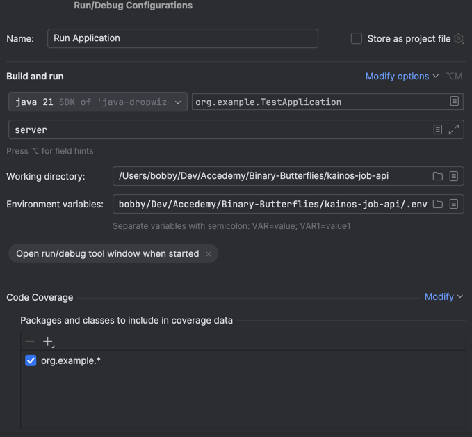
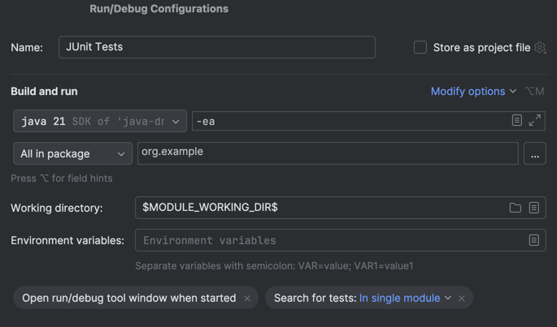

# Kainos Job API

The backend for the Kainos Job Roles Application

---

## Migrations

The application uses Flyway to carry out the database migration scripts.

### Environment Variables

The following environment variables are required to run the migrations:

```bash
FLYWAY_URL=jdbc:mysql://{DB_URL}/{DB_NAME}
FLYWAY_USER={YOUR_USERNAME}
FLYWAY_PASSWORD={YOUR_PASSWORD}
FLYWAY_BASELINE_ON_MIGRATE=true
```

**Note:** Ensure you replace the values inside of the curly braces.

### Running Migrations

To run the migrations, execute the following command:

```bash
mvn flyway:migrate
```

## Building

The recommended way to build and run the project is using IntelliJ IDEA

### Environment File

To run the application, please create a `.env` file in the root of the project based on the `.env.template` file.

### Configuration

Please create a new run configuration with the following parameters:



**Note:** Ensure the "Environment variables" field points to your `.env` file. If there issues using a local path, try the absolute path.

### Running

To run the application, execute the run configuration. The api can be found at [`http://localhost:8080`](http://localhost:8080)

This application also hosts a Swagger page, which can be found at [`http://localhost:8080/swagger`](http://localhost:8080/swagger)

## Health Check

The current health of the application can be found at [`http://localhost:8081/healthcheck`](http://localhost:8081/healthcheck)

## Testing

The application uses JUnit as its testing suite.

### Configuration



**Note:** Ensure the "Environment variables" field contains a semicolon separated list of the environment variables found in your `.env` file.

**Note:** Currently, you cannot supply a path to your `.env` file for running tests.
